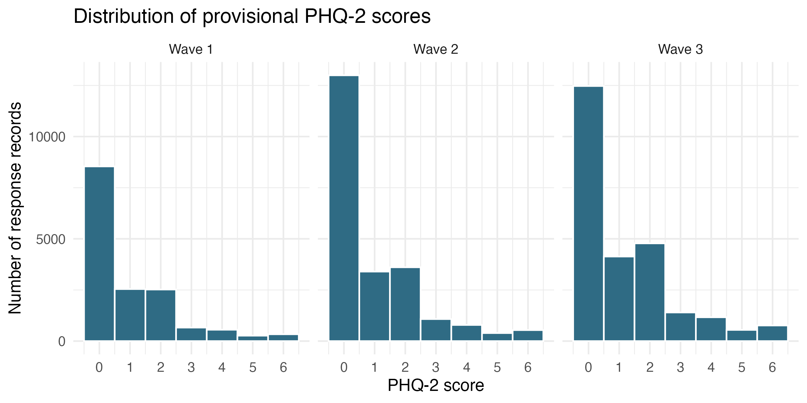
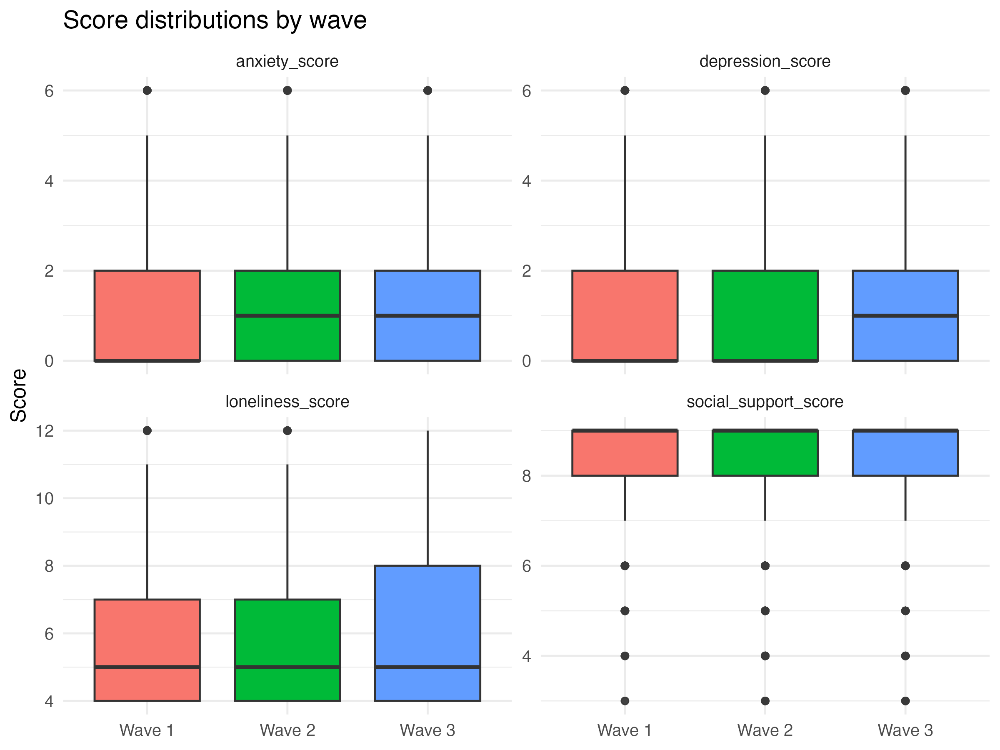

# Leyi-and-Ella-Project

Project Repository for Longitudinal Data Analysis Practical 25/26.

This project prepares the UCL cohorts COVID-19 survey Waves 1-3 for a
longitudinal analysis of depressive symptoms, loneliness, and social
support.

## Title

Loneliness, Social Support, and Depressive Symptoms During COVID-19: A
Three-Wave Longitudinal Analysis of UK Cohort Data

## Background Note

The COVID-19 survey collected information on participants' physical and
mental health, wellbeing, family/relationships, education, and work
across three pandemic waves. Wave 1 was May 2020, Wave 2 was
September/October 2020, and Wave 3 was February/March 2021 during the
third UK lockdown.

## Main Research Question

How did depressive symptoms change across three waves of the COVID-19
pandemic, and were loneliness and social support associated with
depressive symptoms over time?

## Hypotheses

H1: Depressive symptoms will differ across waves, with higher depressive
symptoms expected at Wave 3 compared with Wave 1.

H2: Higher loneliness will be associated with higher depressive symptoms
across waves.

H3: Lower perceived social support will be associated with higher
depressive symptoms across waves.

H4: Social support may moderate the loneliness-depression association,
such that the association between loneliness and depressive symptoms is
weaker among people reporting stronger social support.

## Data Source

The project uses the UCL Cohorts COVID-19 Survey, which collected
information on physical health, mental health, wellbeing, family and
relationships, education, and work during the pandemic.

| Wave   | Timing                 | Raw file                                 |
|--------|------------------------|------------------------------------------|
| Wave 1 | May 2020               | `data/raw/covid-19_wave1_survey_cls.dta` |
| Wave 2 | September/October 2020 | `data/raw/covid-19_wave2_survey_cls.dta` |
| Wave 3 | February/March 2021    | `data/raw/covid-19_wave3_survey_cls.dta` |

The raw data include multiple cohorts: NCDS, BCS70, Next Steps, MCS
cohort members, and MCS parents. Because each cohort uses different ID
variables, the cleaning script creates a common participant identifier
before combining the waves.

# Read This Repository In Order

1.  `analysis/01_data_cleaning.Rmd` reads the raw files from
    `data/raw/`, creates participant keys, recodes documented
    missing-value codes, creates provisional scores, validates ranges,
    and writes `data/processed/analysis_long.rds`.

2.  `analysis/02_data_exploration.Rmd` reads
    `data/processed/analysis_long.rds`, checks structure, missingness,
    attrition, and descriptive distributions, then saves exploratory
    figures to `figures/`.

3.  `analysis/03_mixed_effects_analysis.Rmd` reads
    `data/processed/analysis_long.rds`, prepares the modelling dataset,
    fits random-intercept mixed-effects models, compares model fit,
    tests the hypotheses, and saves model figures and tables.

## Project Structure

``` text
Leyi-and-Ella-Project/
├── Leyi-and-Ella-Project.Rproj
├── README.md
├── .gitignore
├── analysis/
│   ├── 01_data_cleaning.Rmd
│   ├── 02_data_exploration.Rmd
│   └── 03_mixed_effects_analysis.Rmd
├── data/
│   ├── raw/
│   └── processed/
│       └── analysis_long.rds
├── figures/
│   ├── depression_histogram.png
│   ├── loneliness_histogram.png
│   ├── score_boxplots.png
│   ├── model_estimated_depression_by_wave.png
│   └── loneliness_social_support_interaction.png
└── outputs/
    ├── model_sample_table.csv
    ├── icc_table.csv
    ├── model_comparison.csv
    ├── wave_comparisons.csv
    └── moderation_check.csv
    
```

## Data Cleaning Summary

The cleaning stage creates a long-format dataset with one row per
participant per observed wave.

| Output                             |   Rows | Unique participants | Waves |
|------------------------------------|-------:|--------------------:|------:|
| `data/processed/analysis_long.rds` | 67,518 |              33,046 |     3 |

Wave-specific response records:

| Wave   | Records |
|--------|--------:|
| Wave 1 |  16,775 |
| Wave 2 |  24,230 |
| Wave 3 |  26,513 |

## Main cleaning decisions:

1.  A cohort-specific participant ID was created so that the same person
    could be linked across waves.
2.  Negative values were treated as missing values because the data
    dictionary defines them as special missing codes.
3.  Depression and anxiety items were recoded from 1-4 to 0-3 before
    summing, giving PHQ-2 and GAD-2 scores from 0-6.
4.  Loneliness was summed across four items, giving a provisional range
    from 4-12.
5.  Social contact items were reverse-coded so higher scores represent
    more frequent contact.
6.  The three Social Provisions items were combined so higher scores
    represent more perceived support.
7.  support_when_sick and support_for_listening were kept as separate
    support indicators because they use a different response scale.

##Validation Checks Before saving the cleaned dataset, the script checks
that: - row counts match the original raw wave files; - participant IDs
are not missing; - there are no duplicate participant-wave records; -
depression, anxiety, loneliness, social contact, and social support
scores fall within expected ranges.

## Exploratory Findings

Participation patterns show that 12,152 participants were observed in
all three waves.

| Pattern | Meaning                        | Participants |
|---------|--------------------------------|-------------:|
| 111     | Observed in Waves 1, 2, and 3  |       12,152 |
| 011     | Observed in Waves 2 and 3 only |        7,154 |
| 001     | Observed in Wave 3 only        |        5,508 |
| 010     | Observed in Wave 2 only        |        3,609 |
| 101     | Observed in Waves 1 and 3 only |        1,699 |
| 100     | Observed in Wave 1 only        |        1,609 |
| 110     | Observed in Waves 1 and 2 only |        1,315 |

Descriptive means by wave:

| Measure | Wave 1 mean | Wave 2 mean | Wave 3 mean | Pattern |
|----|---:|---:|---:|----|
| Depression score | 0.98 | 0.97 | 1.18 | Slightly higher at Wave 3 |
| Anxiety score | 1.06 | 1.21 | 1.24 | Slight increase over time |
| Loneliness score | 5.81 | 5.81 | 6.12 | Slightly higher at Wave 3 |
| Social contact score | 13.36 | 13.23 | 12.47 | Lower at Wave 3 |
| Social support score | 8.48 | 8.32 | 8.32 | High average support, but large missingness |
| Life satisfaction | 7.12 | 7.10 | 6.67 | Lower at Wave 3 |

Overall, Wave 3 appears especially important for the project question:
depressive symptoms and loneliness are slightly higher, while life
satisfaction and social contact are lower.

## Missingness and Data Quality

The main data-quality issue is social-support missingness. The
three-item social support score is missing for all NCDS and BCS70
participants, suggesting structural questionnaire routing rather than
ordinary random missingness.

This means the project should not simply impute all missing
social-support values as if every participant had been asked the same
questions. A later model should handle this carefully, possibly using
sensitivity checks or alternative support indicators.

The current decision is not to create a listwise-deleted dataset during
cleaning or exploration. Later mixed-effects models plan to use
available participant-wave records (maximum likelihood estimation)
rather than dropping all participants with any missing value.

#Exploratory Figures

The exploration script saves the following figures:

### Depression Score Distribution



### Loneliness Score Distribution


### Missingness in Planned Analysis Variables


### Score Distributions by Wave



## Summary of Findings

The mixed-effects analysis found that depressive symptoms differed
across waves, with Wave 3 significantly higher than Wave 1. Loneliness
was positively associated with depressive symptoms, while social support
was negatively associated with depressive symptoms. Social support also
slightly weakened the association between loneliness and depressive
symptoms.

For the full analysis, see `analysis/03_mixed_effects_analysis.Rmd`.

## Figures

### Estimated Depressive Symptoms Across Waves


### Loneliness And Depressive Symptoms By Social Support


